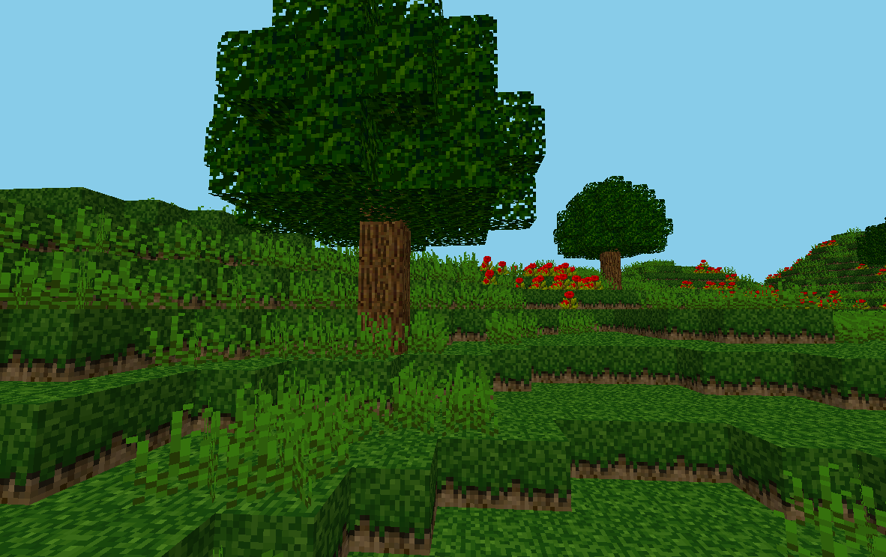

## Chunky

Basic minecraft clone written using Raylib + Odin.  Inspired primarily by Michael Foglmen's `Craft` project (You might see some inspiration in the current worldgen).

### Features
- Terrain generation using simplex noise
- 30+ block types, with plenty more contained in the texture atlas, ready to add
- Sprite support (flowers/torches) and transparency
- Static lighting support, with both ambient and emitted light merged together
- Day / night cycle with basic fog

Right now, I've spent no time implementing a player controller, just mainly demonstrating how easy it is to create voxel games with Raylib.  Infinite terrain generation, caves, editing and first player controls coming soon.

### Installation

Chunky requires no external dependencies as long as you can run `Odin`, since odin packages all the requirements as part of its `vendor` libraries.  I have only tested this on Windows and Linux, but I'm sure it will run anywhere `Odin` does.

### Controls

Currently I just use the Raylib first-person camera controlls, so move around with WASD and look around with the mouse.